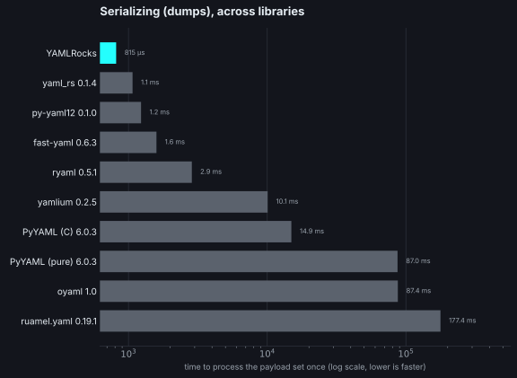

# 🪨 YAMLRocks

[![GitHub Release][releases-shield]][releases]
[![Python Versions][python-versions-shield]][pypi]
![Project Stage][project-stage-shield]
![Project Maintenance][maintenance-shield]
[![License][license-shield]](LICENSE)

[![Build Status][build-shield]][build]
[![Code Coverage][codecov-shield]][codecov]
[![CodSpeed][codspeed-shield]][codspeed]
[![OpenSSF Scorecard][scorecard-shield]][scorecard]
[![Open in Dev Containers][devcontainer-shield]][devcontainer]

Rock-solid YAML for Python, written in Rust.

## About

YAMLRocks is the rock-solid YAML library for Python: a Rust-backed extension
that parses and emits YAML fast, follows the YAML 1.2 specification (with a
YAML 1.1 compatibility mode), and, unlike PyYAML, round-trips documents while
preserving comments, anchors, and formatting.

Rock-solid means three things: correct, secure by default, and fast, with a
Rust core doing the heavy lifting. (The R in Rock is for Rust.)

The Python YAML ecosystem has long forced a trade-off. YAMLRocks refuses it:

| Library       |      Fast       |   YAML 1.2   | Comments / round-trip | Native includes |
| ------------- | :-------------: | :----------: | :-------------------: | :-------------: |
| PyYAML        |  with C loader  | ✗ (1.1 only) |           ✗           |        ✗        |
| ruamel.yaml   | ✗ (pure Python) |      ✓       |           ✓           |        ✗        |
| **YAMLRocks** |    ✓ (Rust)     |      ✓       |           ✓           |        ✓        |

It is also fast. Release-build benchmarks (`python bench/bench.py`) show how
many times faster YAMLRocks is:

| Operation                                    | vs PyYAML (C loader) |   vs ruamel.yaml |
| -------------------------------------------- | -------------------: | ---------------: |
| Parse (`loads`)                              |        ~6-10x faster | ~105-141x faster |
| Serialize (`dumps`)                          |       ~17-19x faster | ~160-208x faster |
| Split config (`!include`, hundreds of files) |          ~17x faster |              n/a |

Across the wider field of Python YAML libraries, on both reading and writing:




See the [comparisons][comparisons] for head-to-head benchmarks and feature
tables against each library. Numbers are machine-dependent; reproduce them with
`python bench/compare.py`.

It is safe against the common YAML attack classes, free-threaded (nogil) ready,
and ships with JSON Schema validation, a PyYAML-compatible shim, rich standard-library
type support, and the `!secret` and `!env_var` config tags.

YAMLRocks is also tested against a reproducible real-world corpus covering Home
Assistant, ESPHome, Ansible, Kubernetes, Docker Compose, GitHub Actions,
CloudFormation, GitOps, Helm, OpenAPI, dbt, CircleCI, Serverless, and Tekton.
Each standalone YAML file must parse and round-trip byte-for-byte; selected Home
Assistant configs are additionally tested through their full `!include` graph.
See [real-world verification][realworld-verification] for the current corpus and
scope.

YAMLRocks is pre-1.0 software. The core promises are already explicit: safe
loading by default, YAML 1.2 semantics, reproducible real-world verification,
and byte-for-byte round-trip for unmodified documents. Some advanced APIs may
still change before 1.0 while the project gathers production feedback. See the
[stability and roadmap][stability-roadmap] page for the 1.0 contract.

## Installation

```bash
pip install yamlrocks
```

Building from source requires a [Rust toolchain][rustup]; see [Setting up
development environment](#setting-up-development-environment) below for the
uv-based build.

## Usage

The API stays small: `loads` returns native Python objects and `dumps`
returns `bytes`.

```python
import yamlrocks

# Parse YAML into native Python objects
data = yamlrocks.loads(b"key: value\nlist:\n  - 1\n  - 2")
# {'key': 'value', 'list': [1, 2]}

# Serialize back to YAML bytes (dumps() returns bytes)
yamlrocks.dumps(data)
# b'key: value\nlist:\n  - 1\n  - 2\n'

# Multiple documents
yamlrocks.loads_all(b"---\na: 1\n---\nb: 2")
# [{'a': 1}, {'b': 2}]

# Load and dump files directly
config = yamlrocks.load("config.yaml")
yamlrocks.dump(config, "config.yaml")
```

### YAML 1.1 compatibility

YAML 1.2 is the default, so `yes`/`no`/`on`/`off` are plain strings. Opt into the
1.1 schema when you need its booleans and octals:

```python
yamlrocks.loads(b"enabled: yes")                              # {'enabled': 'yes'}
yamlrocks.loads(b"enabled: yes", option=yamlrocks.OPT_YAML_1_1)  # {'enabled': True}
```

`OPT_UPGRADE_1_1` reads 1.1 and always emits canonical 1.2, so a project can
ease off the legacy spellings without a manual conversion step.

### Structure-preserving round-trip

```python
doc = yamlrocks.loads(content, option=yamlrocks.OPT_ROUND_TRIP)

doc["server"]["host"] = "example.com"   # deep edits write through to the AST
print(doc.to_yaml().decode())           # comments and formatting preserved
```

An unmodified document re-emits byte-for-byte identical; only the nodes you touch
are rewritten.

### Native includes (read and write back)

```python
doc = yamlrocks.loads(
    content,
    option=yamlrocks.OPT_ROUND_TRIP | yamlrocks.OPT_INCLUDES,
    include_dir="/config",
)

doc["automation"][0]["trigger"] = "state"   # edit a value from an included file

yamlrocks.dump_includes(doc, include_dir="/config")
# Only the modified included file is rewritten; the root config is untouched.
```

Supported tags: `!include`, `!include_dir_named`, `!include_dir_list`,
`!include_dir_merge_named`, `!include_dir_merge_list`.

### Annotated mode (source-location tracking)

```python
data = yamlrocks.loads(content, option=yamlrocks.OPT_ANNOTATED)
data.__line__              # 1
data["server"].__line__    # 3
```

`YAMLRocksAnnotatedDict`/`YAMLRocksAnnotatedList`/`YAMLRocksAnnotatedStr` subclass `dict`/`list`/`str`, so
they behave exactly like the built-ins while carrying `__line__`, `__column__`,
and `__file__`, compatible with Home Assistant's annotated YAML.

### Option flags

Options compose with `|`, the integer bit-flag pattern:

| Flag                                      | Effect                                                          |
| ----------------------------------------- | --------------------------------------------------------------- |
| `OPT_YAML_1_1`                            | YAML 1.1 schema (`yes`/`no` booleans, octals, etc.)             |
| `OPT_UPGRADE_1_1`                         | Read 1.1, always emit canonical 1.2                             |
| `OPT_ROUND_TRIP`                          | Return a `YAMLRocksDocument` preserving comments and formatting |
| `OPT_ANNOTATED`                           | Return subclasses with source locations                         |
| `OPT_INCLUDES`                            | Resolve `!include` tags (needs `include_dir`)                   |
| `OPT_DUPLICATE_KEYS_ERROR`                | Reject a repeated mapping key                                   |
| `OPT_INDENT_2` / `OPT_INDENT_4`           | Indentation width for `dumps`                                   |
| `OPT_SORT_KEYS`                           | Sort mapping keys when dumping                                  |
| `OPT_FLOW_STYLE`                          | Emit flow style (`{}`/`[]`)                                     |
| `OPT_EXPLICIT_START` / `OPT_EXPLICIT_END` | Emit `---` / `...` markers                                      |

See the [documentation][docs] for the full option set, including the standard-library
type and datetime flags.

## Documentation

Full documentation lives at **[yaml.rocks][docs]**: getting-started guides,
recipes (Home Assistant, config editors), the complete API reference, security
notes, and head-to-head comparisons with PyYAML and ruamel.yaml.

## Changelog & Releases

This repository keeps a change log using [GitHub's releases][releases]
functionality. The format of the log is based on
[Keep a Changelog][keepchangelog].

Releases are based on [Semantic Versioning][semver], and use the format
of `MAJOR.MINOR.PATCH`. In a nutshell, the version will be incremented
based on the following:

- `MAJOR`: Incompatible or major changes.
- `MINOR`: Backwards-compatible new features and enhancements.
- `PATCH`: Backwards-compatible bugfixes and package updates.

## Contributing

This is an active open-source project. We are always open to people who want to
use the code or contribute to it.

We've set up a separate document for our
[contribution guidelines](CONTRIBUTING.md).

Using AI tools to help is fine, but you must review and understand everything you
submit. Please read our [AI Policy](AI_POLICY.md) first; autonomous agents are
not allowed, and unreviewed AI output will be closed.

Thank you for being involved! :heart_eyes:

## Setting up development environment

The easiest way to start is by opening a CodeSpace here on GitHub, or by using
the [Dev Container][devcontainer] feature of Visual Studio Code.

[![Open in Dev Containers][devcontainer-shield]][devcontainer]

YAMLRocks is a Rust extension built with [maturin] and managed with [uv], which
handles the Python version, the virtual environment, and every dependency from
`pyproject.toml`. You need:

- A [Rust toolchain][rustup]
- [uv] (it installs a suitable Python 3.12+ for you)
- Node.js 22+ (only for the documentation site and some lint hooks)

To set up the environment and build the extension:

```bash
uv sync                  # create the venv and install all dev dependencies
uv run maturin develop   # build and install the extension (rerun after Rust changes)
```

As this repository uses the [prek][prek] framework, all changes are linted and
tested with each commit. You can run all checks manually:

```bash
prek run --all-files
```

To run just the tests (always under a memory guard during development):

```bash
timeout 120 bash -c 'ulimit -v 3000000; uv run pytest'
```

See [CONTRIBUTING.md](CONTRIBUTING.md) for the full workflow, including the
`just` task runner and how to fetch the optional test-data submodules.

## Authors & contributors

The original setup of this repository is by [Franck Nijhof][frenck].

For a full list of all authors and contributors,
check [the contributor's page][contributors].

## License

MIT License

Copyright (c) 2026 Franck Nijhof

Permission is hereby granted, free of charge, to any person obtaining a copy
of this software and associated documentation files (the "Software"), to deal
in the Software without restriction, including without limitation the rights
to use, copy, modify, merge, publish, distribute, sublicense, and/or sell
copies of the Software, and to permit persons to whom the Software is
furnished to do so, subject to the following conditions:

The above copyright notice and this permission notice shall be included in all
copies or substantial portions of the Software.

THE SOFTWARE IS PROVIDED "AS IS", WITHOUT WARRANTY OF ANY KIND, EXPRESS OR
IMPLIED, INCLUDING BUT NOT LIMITED TO THE WARRANTIES OF MERCHANTABILITY,
FITNESS FOR A PARTICULAR PURPOSE AND NONINFRINGEMENT. IN NO EVENT SHALL THE
AUTHORS OR COPYRIGHT HOLDERS BE LIABLE FOR ANY CLAIM, DAMAGES OR OTHER
LIABILITY, WHETHER IN AN ACTION OF CONTRACT, TORT OR OTHERWISE, ARISING FROM,
OUT OF OR IN CONNECTION WITH THE SOFTWARE OR THE USE OR OTHER DEALINGS IN THE
SOFTWARE.

[build-shield]: https://github.com/frenck/yamlrocks/actions/workflows/tests.yaml/badge.svg
[build]: https://github.com/frenck/yamlrocks/actions/workflows/tests.yaml
[codecov-shield]: https://codecov.io/gh/frenck/YAMLRocks/branch/main/graph/badge.svg
[codecov]: https://codecov.io/gh/frenck/YAMLRocks
[codspeed-shield]: https://img.shields.io/endpoint?url=https://codspeed.io/badge.json
[codspeed]: https://app.codspeed.io/frenck/YAMLRocks?utm_source=badge
[contributors]: https://github.com/frenck/yamlrocks/graphs/contributors
[devcontainer-shield]: https://img.shields.io/static/v1?label=Dev%20Containers&message=Open&color=blue&logo=visualstudiocode
[devcontainer]: https://vscode.dev/redirect?url=vscode://ms-vscode-remote.remote-containers/cloneInVolume?url=https://github.com/frenck/yamlrocks
[docs]: https://yaml.rocks
[frenck]: https://github.com/frenck
[keepchangelog]: http://keepachangelog.com/en/1.0.0/
[license-shield]: https://img.shields.io/github/license/frenck/yamlrocks.svg
[maintenance-shield]: https://img.shields.io/maintenance/yes/2026.svg
[maturin]: https://www.maturin.rs/
[prek]: https://prek.j178.dev
[project-stage-shield]: https://img.shields.io/badge/project%20stage-experimental-yellow.svg
[pypi]: https://pypi.org/project/yamlrocks/
[python-versions-shield]: https://img.shields.io/badge/python-3.12_%7C_3.13_%7C_3.14_%7C_3.15-blue?logo=python&logoColor=white
[realworld-verification]: https://yaml.rocks/verification/real-world-corpus/
[releases-shield]: https://img.shields.io/github/release/frenck/yamlrocks.svg
[releases]: https://github.com/frenck/yamlrocks/releases
[rustup]: https://rustup.rs/
[scorecard-shield]: https://api.scorecard.dev/projects/github.com/frenck/YAMLRocks/badge
[scorecard]: https://scorecard.dev/viewer/?uri=github.com/frenck/YAMLRocks
[semver]: http://semver.org/spec/v2.0.0.html
[comparisons]: https://yaml.rocks/comparisons/
[stability-roadmap]: https://yaml.rocks/stability-roadmap/
[uv]: https://docs.astral.sh/uv/
